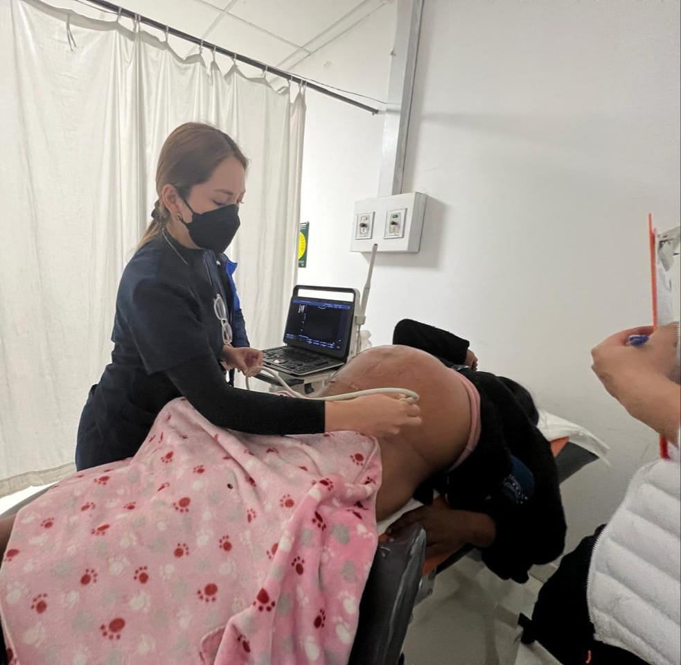

<!DOCTYPE html>
<html lang="es">
<head>
    <meta charset="UTF-8">
    <meta name="viewport" content="width=device-width, initial-scale=1.0">
    <title>Computación Cuántica - La Revolución del Siglo XXI</title>
    
</head>
<body>
    <header>
        

        

            <h1>Computación Cuántica</h1>
            
La Revolución Tecnológica del Siglo XXI

            

                <a href="#que-es" class="btn">Explorar</a>
                <a href="#contactanos" class="btn btn-outline">Contáctanos</a> <!-- Botón "Contáctanos" en el header -->
            

        

    </header>
    
    <nav>
        

            
QuantumTech

            <ul class="nav-links">
                <li><a href="#inicio">Inicio</a></li>
                <li><a href="#que-es">¿Qué es?</a></li>
                <li><a href="#puntos-clave">Puntos Clave</a></li>
                <li><a href="#aplicaciones">Aplicaciones</a></li>
                <li><a href="#ciberseguridad">Ciberseguridad</a></li>
                <li><a href="#futuro">Futuro</a></li>
                <li><a href="#integrantes">Integrantes</a></li>
                <li><a href="#contactanos">Contáctanos</a></li> <!-- Enlace "Contáctanos" en la navegación principal -->
            </ul>
            
☰

        

    </nav>
    
    <section id="inicio">
        <h2>Bienvenidos a la Era Cuántica</h2>
        
La <strong>computación cuántica</strong> no es solo una evolución tecnológica, es un <strong>cambio de paradigma</strong> que promete revolucionar cómo procesamos información, resolvemos problemas complejos y aceleramos descubrimientos científicos.

        
        

            <h3>¿Por qué es importante?</h3>
            <ul>
                <li><strong>Potencial exponencial</strong>: Resuelve problemas que las computadoras clásicas no pueden abordar, desde el diseño de nuevos fármacos hasta la optimización de sistemas globales.</li>
                <li><strong>Nuevos horizontes</strong>: Permite simulaciones moleculares, cifrado indescifrable y avances en inteligencia artificial.</li>
                <li><strong>Más allá de la Ley de Moore</strong>: Mientras los chips clásicos se acercan a sus límites físicos, la computación cuántica ofrece un camino hacia el futuro.</li>
            </ul>
        

        
        

            "La computación cuántica no es solo más rápida, es radicalmente diferente."
        

        <!-- YouTube Video Embed -->
        

            <iframe 
                src="https://www.youtube.com/embed/mnwU98tIMBY" 
                frameborder="0" 
                allow="accelerometer; autoplay; clipboard-write; encrypted-media; gyroscope; picture-in-picture" 
                allowfullscreen 
                style="position: absolute; top: 0; left: 0; width: 100%; height: 100%; border-radius: 10px;">
            </iframe>
        

    </section>
    
    <section id="que-es">
        <h2>¿Qué es la Computación Cuántica?</h2>
        
        <h3>Diferencias Clave: Clásica vs. Cuántica</h3>
        <table class="comparison-table">
            <tr>
                <th>Computación Clásica</th>
                <th>Computación Cuántica</th>
            </tr>
            <tr>
                <td>Usa <strong>bits</strong> (0 ó 1)</td>
                <td>Usa <strong>qubits</strong> (0, 1 o ambos a la vez)</td>
            </tr>
            <tr>
                <td>Opera con puertas lógicas booleanas</td>
                <td>Opera con matrices cuánticas (Hadamard, CNOT)</td>
            </tr>
            <tr>
                <td>Procesamiento secuencial</td>
                <td><strong>Superposición</strong>: Cálculos en paralelo</td>
            </tr>
        </table>
        
        <h3>Los Pilares de la Computación Cuántica</h3>
        

            

                
⚡

                <h4>Superposición</h4>
                
Un qubit puede estar en <strong>0, 1 o ambos estados simultáneamente</strong> (como una moneda girando en el aire). Ejemplo: 30 qubits pueden representar <strong>2³⁰ = 1,073,741,824 estados a la vez</strong>.

            

            
            

                
🔗

                <h4>Entrelazamiento Cuántico</h4>
                
Dos qubits entrelazados están <strong>correlacionados instantáneamente</strong>, sin importar la distancia. Clave para <strong>criptografía cuántica</strong> y algoritmos optimizados.

            

            
            

                
🌀

                <h4>Interferencia Cuántica</h4>
                
Refuerza resultados correctos y cancela los incorrectos, mejorando la eficiencia de los algoritmos.

            

        

        
        

            "Las puertas cuánticas no siguen el Álgebra de Boole, sino el álgebra lineal matricial."
        

    </section>

    <section id="puntos-clave">
        <h2>Puntos Clave a Saber</h2>
        
Aquí te presentamos los aspectos más importantes a comprender sobre la computación cuántica.

        

            

                <h4>No es un reemplazo directo</h4>
                
La computación cuántica no reemplazará a las computadoras clásicas. Es una tecnología complementaria diseñada para resolver tipos específicos de problemas extremadamente complejos.

            

            

                <h4>El "Invierno Cuántico"</h4>
                
Existe la posibilidad de un "invierno cuántico" si las expectativas superan los avances reales, lo que podría llevar a una disminución de la inversión y el interés. La investigación es clave.

            

            

                <h4>Impacto en la Ciberseguridad</h4>
                
La computación cuántica representa una amenaza para los métodos de cifrado actuales (como RSA). Es crucial desarrollar y migrar a la criptografía post-cuántica.

            

            

                <h4>Potencial Transformador</h4>
                
A pesar de los desafíos, su potencial para revolucionar campos como la medicina, la ciencia de materiales, la inteligencia artificial y la logística es inmenso.

            

            

                <h4>Fase de Investigación y Desarrollo</h4>
                
Actualmente, la computación cuántica se encuentra en una etapa temprana de investigación y desarrollo. Los ordenadores cuánticos actuales son ruidosos y propensos a errores, pero mejoran rápidamente.

            

            

                <h4>Accesibilidad en la Nube</h4>
                
Grandes empresas como IBM y Microsoft ofrecen acceso a procesadores cuánticos a través de la nube, permitiendo a investigadores y desarrolladores experimentar con esta tecnología.

            

        

    </section>
    
    <section id="aplicaciones">
        <h2>Aplicaciones en la Industria</h2>
        
        <h3>Problemas que la Computación Cuántica Puede Resolver</h3>
        <ul>
            <li><strong>Optimización</strong>: Rutas logísticas, gestión de energía</li>
            <li><strong>Simulación</strong>: Moléculas para nuevos fármacos</li>
            <li><strong>Machine Learning</strong>: Entrenamiento acelerado de IA</li>
        </ul>
        
        <h3>Sectores Clave</h3>
        

            <h4>Salud y Ciencias</h4>
            <ul>
                <li>Diseño de fármacos (ej: COVID-19)</li>
                <li>Medicina personalizada (análisis de ADN)</li>
                <li>Simulación de procesos moleculares</li>
            </ul>
        

        
        

            <h4>Finanzas</h4>
            <ul>
                <li>Detección de fraudes</li>
                <li>Optimización de carteras de inversión</li>
                <li>Análisis de riesgos</li>
            </ul>
            
<em>JP Morgan, Goldman Sachs ya están explorando estas aplicaciones</em>

        

        
        

            <h4>Logística y Energía</h4>
            <ul>
                <li>Optimización de rutas (Amazon, DHL)</li>
                <li>Redes eléctricas inteligentes</li>
                <li>Gestión de inventarios</li>
            </ul>
        

        
        

            <h4>IA y Automoción</h4>
            <ul>
                <li>Coches autónomos más seguros</li>
                <li>Redes neuronales cuánticas</li>
                <li>Procesamiento de lenguaje natural</li>
            </ul>
        

        
        

            "Empresas como IBM, Google y Microsoft ya están desarrollando soluciones cuánticas para estos sectores."
        

    </section>
    
    <section id="ciberseguridad">
        <h2>Ciberseguridad en la Era Cuántica</h2>
        
        <h3>Amenazas Cuánticas</h3>
        

            
<strong>🔓 Algoritmo de Shor</strong>: Puede romper el cifrado RSA y ECC en segundos.

            
<strong>⚠ "Guarda Ahora, Descifra Después" (SNDL)</strong>: Hackers almacenan datos cifrados hoy para descifrarlos mañana.

        

        
        <h3>Soluciones Cuánticas</h3>
        

            

                
🛡️

                <h4>Criptografía Post-Cuántica (PQC)</h4>
                
Algoritmos basados en <strong>retículos (NTRU)</strong> e <strong>isogenias (SIDH)</strong> resistentes a ataques cuánticos.

            

            
            

                
🔑

                <h4>Distribución Cuántica de Claves (QKD)</h4>
                
Método de comunicación intrínsecamente seguro basado en principios cuánticos. <strong>Proyecto MADRID-Q</strong> y <strong>LuxQuanta</strong> lideran su desarrollo en España.

            

            
            

                
💾

                <h4>Chip Majorana 1 (Microsoft)</h4>
                
Qubits topológicos más estables para criptografía segura y autenticación cuántica.

            

        

        
        

            "Infraestructuras críticas (bancos, gobiernos) deben migrar ya a criptografía post-cuántica."
        

    </section>
    
    <section id="futuro">
        <h2>Desafíos y Futuro</h2>
        
        <h3>Retos Actuales</h3>
        

            

                
❌

                <h4>Decoherencia Cuántica</h4>
                
Los qubits son frágiles (requieren -273°C y aislamiento extremo).

            

            
            

                
❌

                <h4>Escalabilidad</h4>
                
Hoy solo hay chips de decenas de qubits (IBM Eagle: 127 qubits).

            

            
            

                
❌

                <h4>Software</h4>
                
Falta de herramientas maduras (Qiskit, Cirq están en desarrollo).

            

        

        
        <h3>Perspectivas Futuras</h3>
        

            

                

                    <h4>2023-2025</h4>
                    
Avances en corrección de errores. Primeros algoritmos prácticos en optimización.

                

            

            

                

                    <h4>2025-2030</h4>
                    
Ordenadores cuánticos tolerantes a fallos. Mercado de $100 mil millones.

                

            

            

                

                    <h4>2030+</h4>
                    
Computación cuántica universal. Posible "invierno cuántico" si no se cumplen expectativas.

                

            

        

    </section>
    
    <section id="integrantes">
        <h2>Autores</h2>
        
Conoce a los miembros clave detrás de la iniciativa computación cuántica.

        

            

                Jerson Arcos Durand</h4>
                
Líder de Proyecto

            

            

                Samantha Galindo Mujica</h4>
                
Investigadora Cuántica

            

            

                Noemi Merari Altamirano Orosco</h4>
                
Desarrollador de Software Cuántico

            

            

                Sinai Altamirano Orosco</h4>
                
Especialista en Ciberseguridad Cuántica

            

        

    </section>

    <section id="recursos">
        <h2>Más información</h2>
        

            

                <h4>Computing</h4>
                
Qué es la computación cuántica y para qué sirve, y qué son los ordenadores cuánticos, son interrogantes que surgen ante el protagonismo que está adquiriendo esta tecnología.

                <a href="https://www.computing.es/informes/computacion-cuantica-que-es-y-como-funciona/" class="resource-link" target="_blank">Visitar →</a>
            

            
            

                <h4>Principios de la computación cuántica</h4>
                
Leyes físicas que imponían algunas limitaciones al proceso de cómputo.

                <a href="https://enginyeriainformatica.cat/wp-content/uploads/2016/05/PRINCIPIOS-FUNDAMENTALES-DE-COMPUTACI%C3%93N-CU%C3%81NTICA.pdf" class="resource-link" target="_blank">Visitar →</a>
            

    
            

        

    </section>
    
    <section id="contactanos" class="contact-section">
        <h2>Contáctanos</h2>
        
Puedes enviarnos un correo electrónico a:

        
<a href="mailto:018100111k@uandina.edu.pe">018100111k@uandina.edu.pe</a>

        
<a href="mailto:017200419h@uandina.edu.pe">017200419h@uandina.edu.pe</a>

        
<a href="mailto:019200457e@uandina.edu.pe">019200457e@uandina.edu.pe</a>

    </section>
        
        

            
Linfokillers-Cenfoti-UAC

            
AUXILIO

            
Cusco-Perú

            
2025
        

    </footer>
    
    
</body>
</html>
